## Restaurant POS and Website

**Built with these:** 

   

**Using:** Php 7.4

**Features:**
* **Customer Side (customerSide Folder):** Stores the website and allows customers to:
    * Make reservations
    * Register for accounts
    * View profile points
* **Staff Side (adminSide Folder):** Stores the panels and allows staff to:
    * Take orders
    * Send orders to the kitchen
    * Process payments
    * Print receipts
    * Manage CRUD operations
    * View user preferences
    * Download reports
    * View charts and graph

**Steps to run the project locally :**

1. Open XAMPP, start MySQL.
2. Copy all the folders and files (adminSide, customerSide, index.php, and restaurantDB.txt) into the `htdocs` directory.
3. Make sure there is no database named `restaurantdb`.
4. Run the project from http://localhost/RestaurantProject-main/customerSide/home/home.php.

## Example accounts

| Role | Email | Password |
|---|---|---|
| Customer | fahim@gmail.com | fakepass |
| Staff | 1 | fakepass |
| Admin | 99999 | 12345 |

## Screenshots
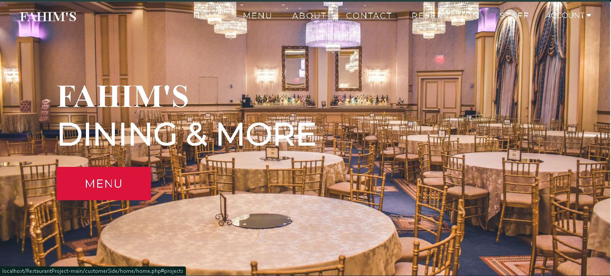 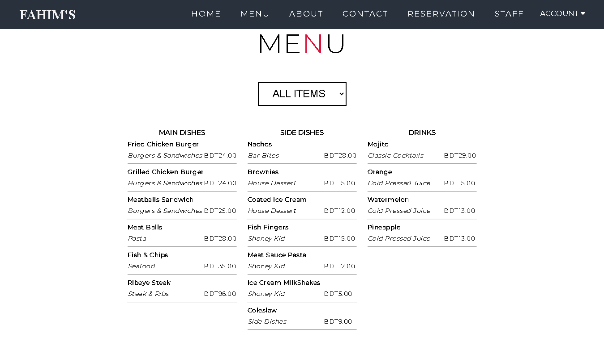 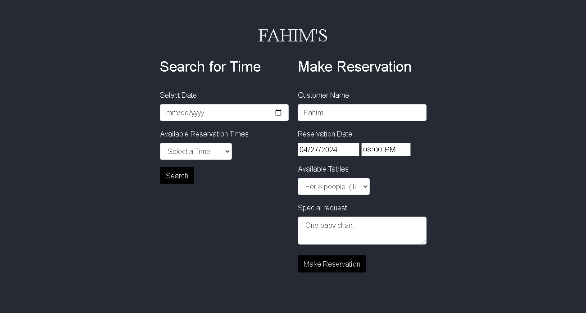 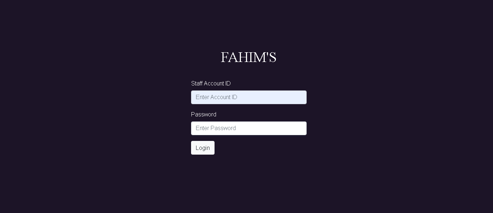 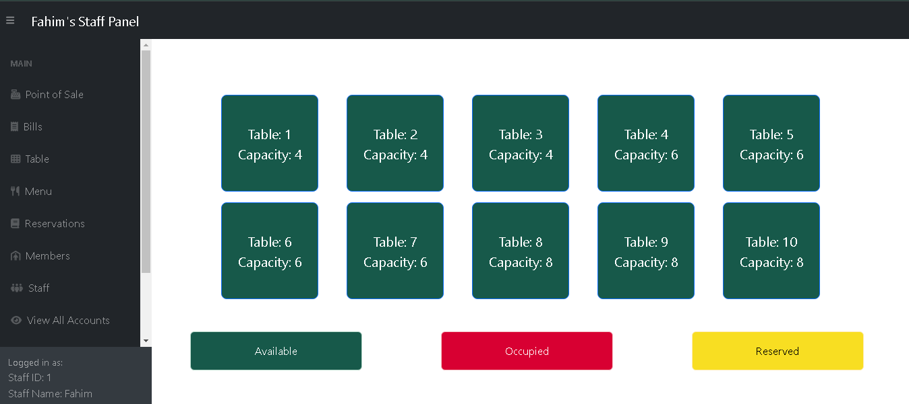 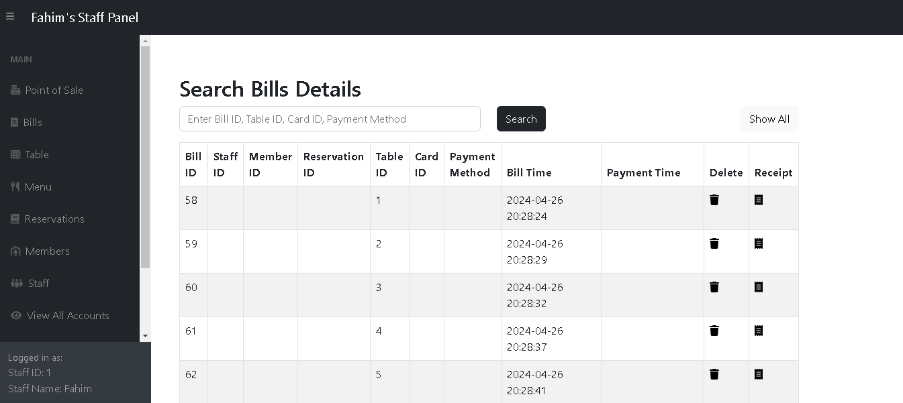 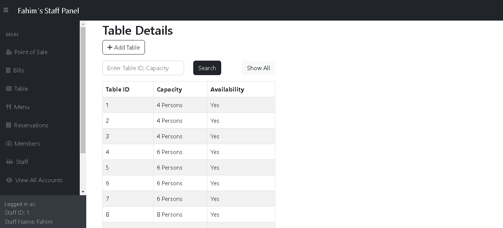  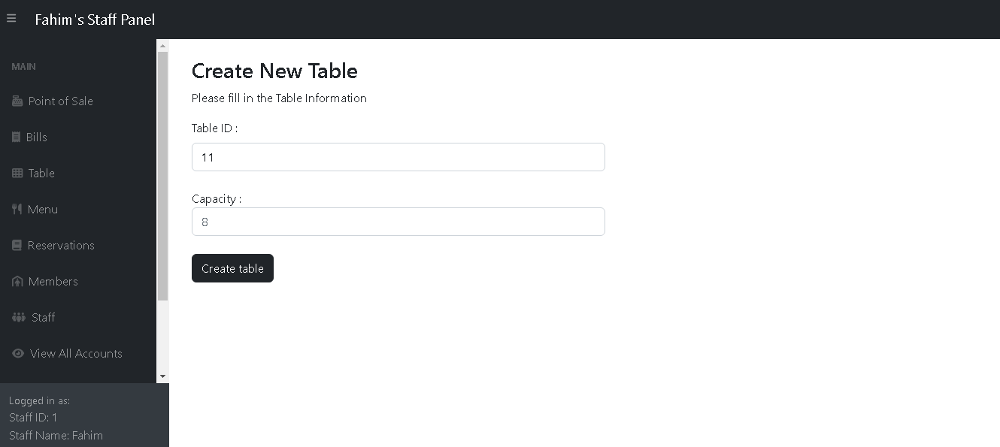 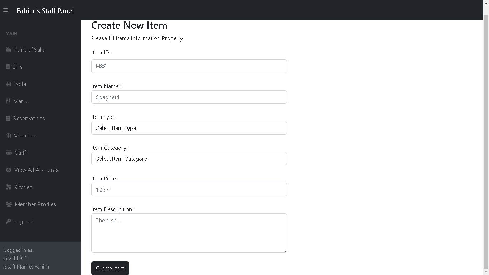 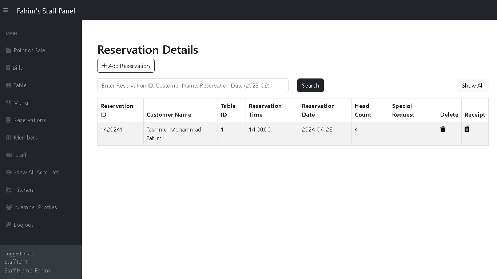 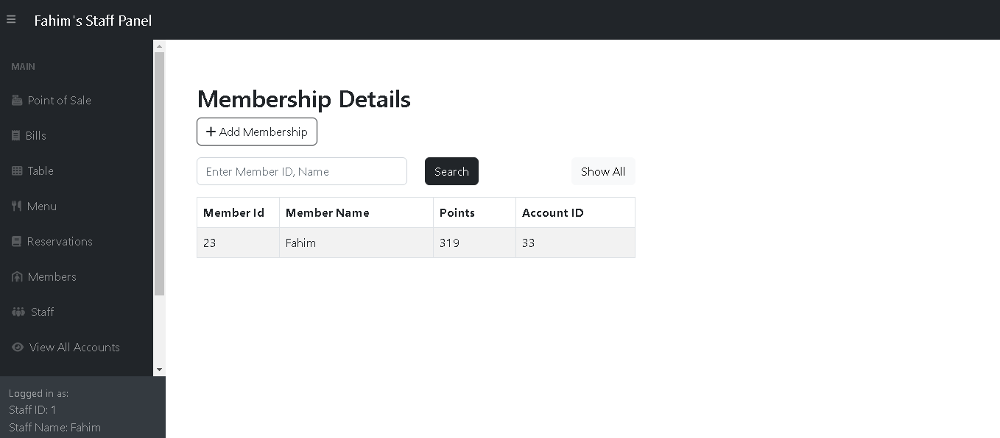 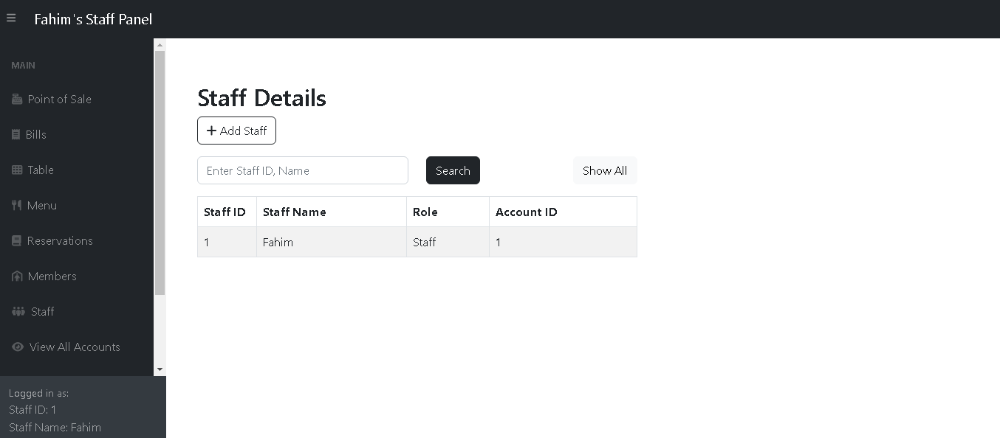 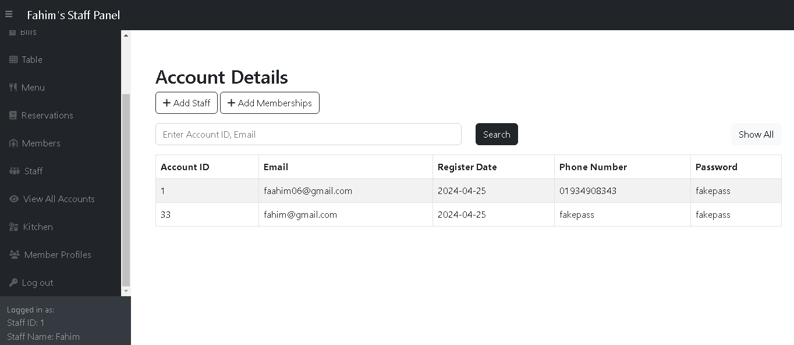 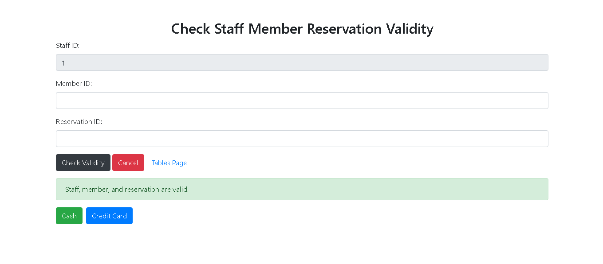 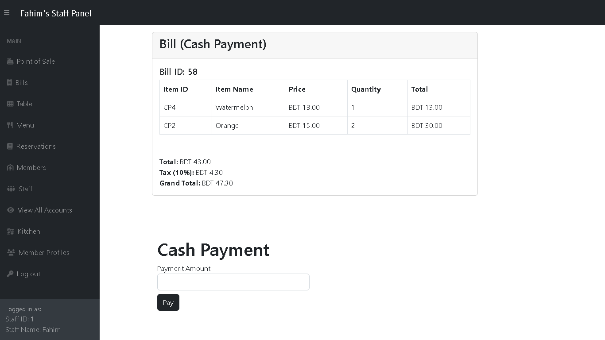 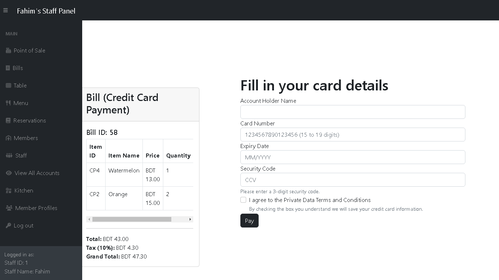 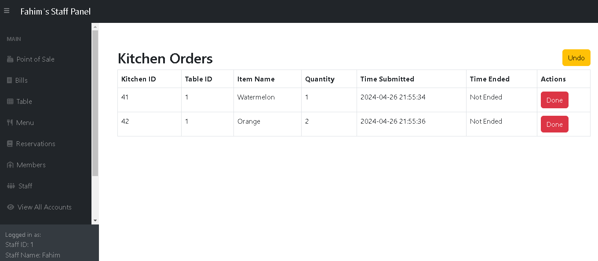